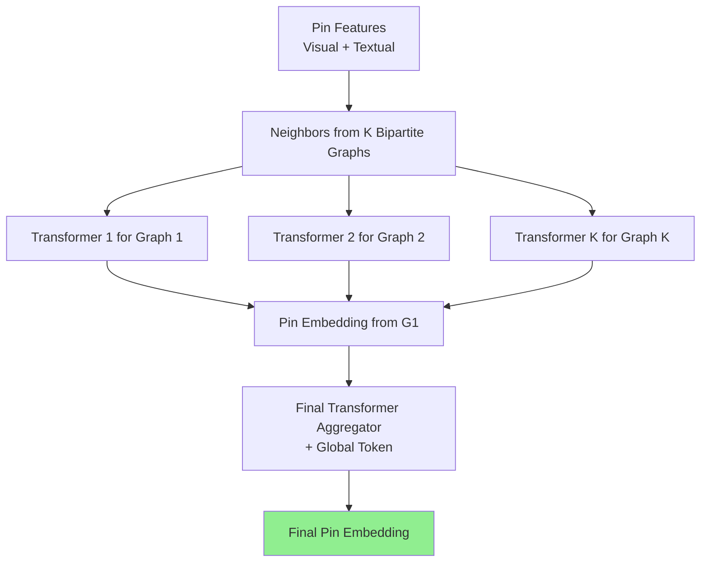

**MultiBiSage** — это статья 2022 года (опубликована в PVLDB) от команды Pinterest (с участием Jure Leskovec и др.), которая описывает переход от PinSage (их предыдущей GCN-модели) к более мощной системе рекомендаций на основе нескольких би-партийных графов.

### Что они предложили?

**Проблема**: PinSage работал только на одном би-партийном графе **Pin-Board** (пины → доски). Но на Pinterest много сущностей (пользователи, idea pins, creators, продукты, ads, search queries и т.д.) и разнообразных взаимодействий (click, long-click, follow, add-to-cart и др.). Эти сигналы содержат богатую информацию, но полноценные heterogeneous GNN (типа HGT) на веб-масштабе (миллиарды узлов) были непрактичны из-за памяти, сэмплинга и инфраструктуры.

**Решение — прагматичный подход**:
1. Разбили гетерогенный граф на **несколько отдельных би-партийных графов** (6 штук в экспериментах: Pin-Board, User-Product, User-Ad, SearchQuery-Pin и др.).
2. Для каждого графа с помощью существующей системы **Pixie** (оптимизированные random walks на огромных графах) заранее находили топ-k соседей пина (не "on-the-fly" сэмплинг во время обучения — это критично для масштаба).
3. Предложили **MultiBiSage** — transformer-based архитектуру:
   - Для каждого би-партийного графа: FFN на visual/textual features пина + его соседей → Transformer (multi-head attention) → отдельное представление пина от этого графа.
   - Затем второй Transformer агрегирует все эти представления (плюс глобальный токен) в финальное эмбеддинг пина.
4. Обучение с **mixed negative sampling** + sampled softmax для эффективности.

Это позволило использовать существующую инфраструктуру Pinterest (Pixie, Spark, training pipelines) без радикальной перестройки. Модель обучили на графах с **~4.8+ млрд узлов и 9.7+ млрд рёбер** — один из самых больших применений heterogeneous graph моделей на тот момент.

**Результаты**: Значительное улучшение по Recall@10 на разных поверхностях (organic, ads, idea pins, video pins) — от +1.5% до +7%+ по сравнению с продакшен PinSage.

### Насколько это SOTA в 2026 году?

**Не cutting-edge, но солидный и практичный вклад**:
- К 2026 году в рекомендациях доминируют более сложные вещи: LLM-based recommenders, multi-modal foundation models, advanced heterogeneous GNN с contrastive learning, dynamic graphs, disentangled representations и т.д. Появилось много работ по multi-behavior, sequential и cross-domain рекомендациям.
- Однако **MultiBiSage** остаётся отличным примером **production-grade** решения для веб-масштаба. Многие компании до сих пор сталкиваются с похожими проблемами (масштаб + legacy infrastructure), и идея "разбить heterogeneous graph на би-партийные + dedicated transformers + precomputed neighbors" очень разумна.
- Цитируется (~27+ цитат), упоминается в обзорах GNN для RecSys. Не революция, но надёжный мост между академическими HGT и реальным продакшеном.

### Влияние на индустрию

- **Pinterest**: Стал следующим шагом после PinSage в их эволюции рекомендаций. Помог лучше учитывать разнообразные сигналы и улучшил пользовательский engagement. Pinterest продолжает активно публиковать про свои RecSys (PinnerSage и др.).
- **Шире**: Показал, что для промышленного применения не всегда нужны супер-сложные distributed heterogeneous GNN — можно умно использовать существующие инструменты (random walks + transformers). Это повлияло на мышление в industry: "decompose and conquer" для heterogeneous graphs. Идеи precomputed neighborhoods и multi-view (multi-graph) aggregation используются/вдохновляют в других больших RecSys.

### Схема модели MultiBiSage

Вот упрощённая схема архитектуры (сгенерирована на основе описания из статьи):

**Ключевые компоненты**:
- **Слева**: Features пина (visual + textual) + neighbors из каждого би-партийного графа.
- **Средина**: Отдельный Transformer для каждого графа (обрабатывает последовательность: self + neighbors).
- **Справа**: Финальный Transformer, который агрегирует эмбеддинги от всех графов → единое pin embedding.

Модель эффективно сочетает **локальную структуру** из разных типов взаимодействий с мощью трансформеров для агрегации.

Если нужно больше деталей (например, ablation studies, конкретные метрики или сравнение с современными моделями) — спрашивай!