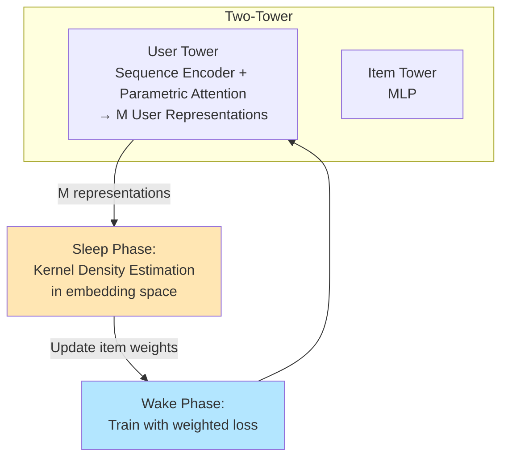

**Density Weighting for Multi-Interest Personalized Recommendation (IDW)** — статья 2023 года от исследователей Google (Nikhil Mehta и др., включая Ed H. Chi). Она решает важную проблему в **Multi-User Representation (MUR)** моделях для рекомендаций.

### Что они предложили?

**Проблема**:  
Модели с **Multiple User Representations (MUR)** (несколько эмбеддингов пользователя вместо одного — SUR) лучше моделируют разнообразные интересы пользователя. Однако на реальных данных с сильным **long-tail** (skewed/imbalanced) распределением items/interests их преимущество сильно снижается. Модель "залипает" на head (популярных) items, а tail (редкие) интересы плохо представляются.

**Основные вклады**:

1. **Анализ на синтетических данных** (Hidden Markov Model для генерации последовательностей с контролируемым skewness):
   - Показали, как растёт skewness → падает качество MUR (особенно на tail).
   - MUR даёт лучшее кластерирование item representations, чем SUR, но imbalance разрушает это преимущество.

2. **Iterative Density Weighting (IDW)** — главная инновация:
   - Используют **плотность в пространстве item embeddings** (kernel smoothing с Gaussian kernel), а не просто частоту items.
   - **Итеративный процесс** (Sleep-Wake):
     - **Sleep**: Обновляют веса items на основе текущей плотности в representation space (upweight редкие регионы, downweight dense/popular).
     - **Wake**: Тренируют two-tower модель с этими весами.
   - После сходимости — **User Tower Calibration** (замораживают item tower и дообучают user tower на обычном loss).

3. **Архитектура**: Two-tower (user tower с parametric attention для извлечения M представлений + item tower MLP) + batch softmax с LogQ correction.

**Результаты**: На трёх публичных датасетах (MovieLens-1M, Kindle, Clothing) IDW+MUR значительно лучше baseline MUR и других методов балансировки (Frequency Balance, Focal Loss, Qmargin, Item Norm) — особенно на tail items, без сильного ущерба head.

### Насколько это SOTA в 2026 году?

**Очень актуально и практически полезно, но не самое передовое**.

- **Плюсы**: Идея density-based weighting в embedding space + итеративный Sleep-Wake + calibration — элегантное и эффективное решение long-tail проблемы именно для MUR. Хорошо работает в production two-tower retrieval.
- **Минусы / развитие к 2026**:
  - Появились более мощные подходы: contrastive learning, LLM-based user modeling, hierarchical/multi-modal interests, dynamic routing (типа ComiRec/MIND), graph-based multi-interest, и особенно foundation models для рекомендаций.
  - Long-tail продолжают решать через retrieval+ranking cascades, distillation, data augmentation, и advanced sampling.
  - IDW остаётся сильным **baseline** и практическим методом для индустрии, особенно там, где важна именно robustness MUR к imbalance без сложных архитектурных изменений.

В 2026 году это уже "классика" в теме multi-interest + long-tail, но активно используется/расширяется в production RecSys.

### Влияние на индустрию

- **Google**: Статья отражает внутренние практики Google (YouTube, Play и др.), где two-tower + multi-interest — стандарт. IDW помогает лучше работать с длинным хвостом, что критично для масштаба.
- **Шире**: 
  - Популяризировала использование **density в embedding space** вместо простой frequency-based balancing.
  - Показала важность **iterative reweighting** и **user tower calibration**.
  - Влияет на последующие работы по robust multi-interest modeling.
  - Цитируется в исследованиях long-tail RecSys и multi-behavior рекомендациях.

### Схема модели (IDW + MUR)

Вот визуальная схема архитектуры и процесса:

**Ключевые компоненты**:
- **User Tower**: Transformer/Self-Attention + Parametric Attention → M user interest vectors.
- **Item Tower**: Простой MLP.
- **IDW цикл**: Density estimation → Weight update → Weighted training.
- **Calibration**: Финальная дообучка user tower.

Если нужно больше деталей (сравнение с MultiBiSage, ablation'ы, код/реализация или сравнение с современными методами) — спрашивай!