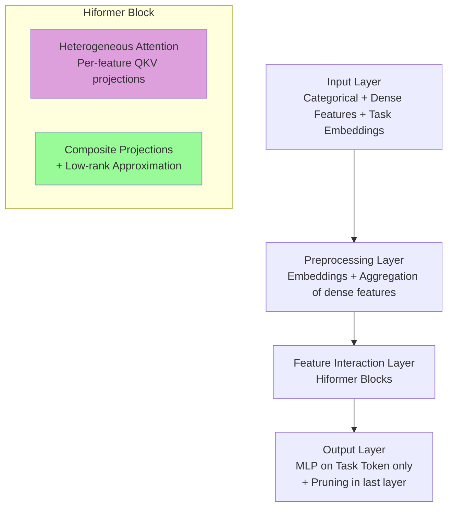

**Hiformer: Heterogeneous Feature Interactions Learning with Transformers for Recommender Systems** (2023, Google DeepMind/Google) — статья, посвящённая эффективному моделированию **feature interactions** в веб-масштабных рекомендательных системах с помощью Transformer-архитектуры.

### Что они предложили?

**Проблема**:
- В промышленных RecSys (например, Google Play) огромное количество разнородных фич (categorical + dense), очень разреженных.
- Feature interactions (особенно высших порядков) крайне важны, но вручную их проектировать невозможно.
- Vanilla Transformer (и AutoInt) плохо работает, потому что использует **одинаковые** projection matrices (Q/K/V) для всех фич → не учитывает **heterogeneity** (семантика одной фичи сильно зависит от контекста другой).

**Основные вклады**:

1. **Heterogeneous Attention Layer** (простая, но эффективная модификация self-attention):
   - Для каждой фичи — **свои** Q, K, V проекции (per-feature query/key/value matrices).
   - Это даёт "feature semantic awareness" — модель может по-разному трансформировать и выравнивать семантику фич в зависимости от пары.

2. **Hiformer** (Heterogeneous Interaction Transformer):
   - Улучшает heterogeneous attention за счёт **Composite projections** (более выразительные low-rank проекции в QKV).
   - Сначала создаёт "composite features", потом взаимодействует с ними.

3. **Оптимизации для production**:
   - **Low-rank approximation** для Composite проекций.
   - **Model Pruning**: В последнем слое только task token (CLS-like) выступает как query, а features — как key/value. Это снижает сложность с квадратичной до почти линейной по количеству фич.

**Архитектура в целом**:
- Input → Preprocessing (embeddings categorical + aggregated dense) + Task embeddings.
- Несколько слоёв Hiformer.
- Только encoded task embedding → MLP → prediction (binary classification).

**Результаты**:
- Offline: outperforms AutoInt, DLRM, DCN, vanilla Transformer.
- Online A/B test в Google Play: **+2.66%** в ключевых engagement метриках при приемлемом росте latency.

### Насколько это SOTA в 2026 году?

**Очень сильный production-oriented подход**, но уже не самый передовой.

- **Сильные стороны**: Практичное решение проблемы heterogeneous feature interactions в sparse web-scale данных. Идеи per-feature/projection awareness и composite low-rank projections остаются актуальными.
- **Развитие к 2026**: 
  - Transformers в RecSys стали более распространёнными (особенно с LLM-based user modeling и retrieval).
  - Появились более эффективные архитектуры (Linear attention, State Space Models, Mixture-of-Experts и т.д.).
  - Многие команды комбинируют идеи Hiformer с modern efficient Transformers или используют их в hybrid retrieval+ranking pipelines.
- Hiformer — отличный **baseline** и источник вдохновения для industrial RecSys. Особенно ценен тем, что реально задеплоен в продакшене Google.

### Влияние на индустрию

- **Google**: Успешно задеплоен в App ranking Google Play → прямое влияние на миллиарды пользователей.
- **Шире**: 
  - Показал, что Transformer-based модели **могут** работать в latency-sensitive веб-масштабе при правильных оптимизациях.
  - Популяризировал идею **heterogeneous/per-feature attention** для RecSys.
  - Стал мостом между успехами Transformers в NLP/CV и рекомендациями.
  - Влияет на последующие работы по efficient feature interaction modeling и explainable RecSys (attention patterns хорошо интерпретируемы).

### Схема модели Hiformer

Вот визуальная схема:

**Ключевые отличия от vanilla Transformer**:
- Per-feature Q/K/V → heterogeneous modeling.
- Composite low-rank projections → больше expressiveness.
- Pruning + low-rank → production latency.

Если хочешь сравнение с MultiBiSage / IDW, больше деталей по экспериментам или ablation'ам — дай знать!